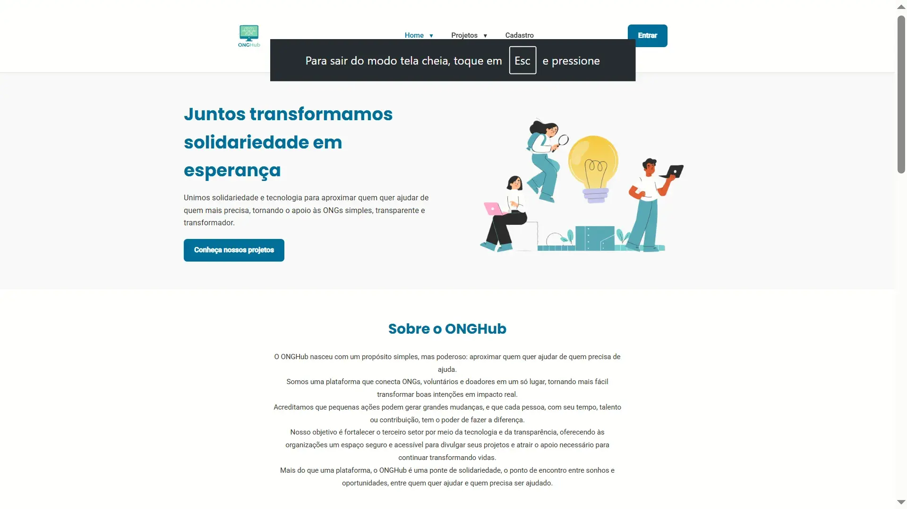
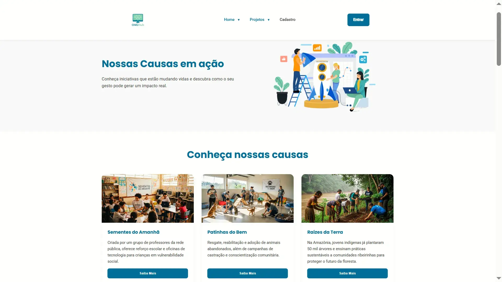
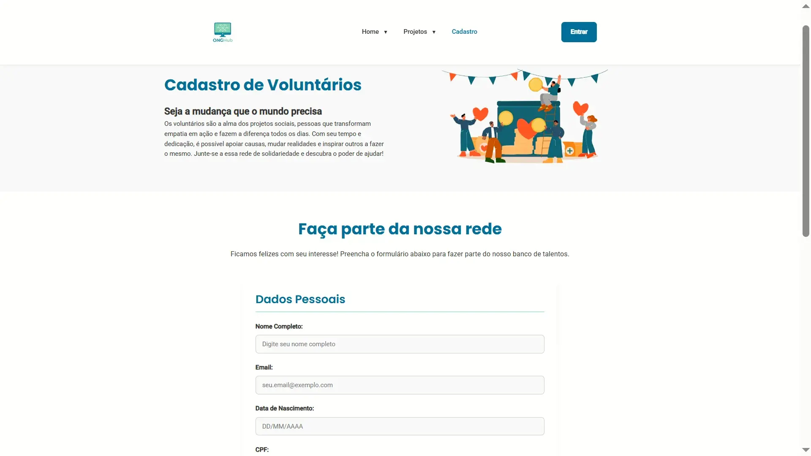

[]()


# 🌟 ONGHub - Conectando Causas a Voluntários
---

## 🚀 Demonstração

🔗 **Acesse o projeto online:**  
👉 [https://onghub.vercel.app/](https://onghub.vercel.app/)

---

## 🎓 Contexto do Projeto

Desenvolvido como trabalho acadêmico para a disciplina de **Desenvolvimento Web Frontend**, este projeto demonstra a implementação de um portal completo para ONGs utilizando as melhores práticas de desenvolvimento web moderno.

### 🎯 Objetivos de Aprendizado
- Arquitetura SPA e componentes reutilizáveis  
- Validação avançada de formulários  
- Design system e acessibilidade  
- Otimização e performance  

### ⚠️ Observações
- Projeto **frontend demonstrativo**  
- Funcionalidades simuladas para fins educacionais  
- Foco em código limpo e boas práticas  

---

## 📋 Sobre o Projeto

O **ONGHub** é uma plataforma inovadora que conecta ONGs, voluntários e doadores em um único ecossistema solidário. Nosso objetivo é transformar a solidariedade em ações concretas e impactantes.

### 🎯 Objetivos
- **Facilitar** o encontro entre quem quer ajudar e quem precisa de ajuda  
- **Otimizar** o processo de doações e voluntariado  
- **Promover** transparência e confiança no terceiro setor  

### ✨ Principais Características
- **🏠 Página Inicial** - Apresentação institucional com seções: Sobre, Pilares, Impacto e Contato  
- **📊 Página de Projetos** - Galeria de causas, sistema de doações, FAQ e voluntariado  
- **👥 Página de Cadastro** - Formulário completo com validação avançada  
- **🎯 Navegação SPA** - Experiência fluida sem recarregamento de página  
- **📱 Design Responsivo** - Adaptado para todos os dispositivos  

---

## 🛠️ Funcionalidades Técnicas

- **Sistema SPA** (Single Page Application)  
- **Validação de Formulários** em tempo real  
- **Menu Responsivo** com submenus dropdown  
- **Sistema de Templates** em JavaScript  
- **Componentes Modais** interativos  
- **Otimização Avançada** (minificação e compressão)  

---

## 🧩 Estrutura SPA

O projeto utiliza JavaScript puro para simular uma **SPA (Single Page Application)**, carregando seções dinamicamente sem recarregar a página.  
Isso proporciona uma navegação mais fluida e moderna, sem dependências de frameworks externos.

---

## 🛠️ Tecnologias Utilizadas

### Frontend
- **HTML5** → Estrutura semântica e acessível  
- **CSS3** → Variáveis CSS, Grid, Flexbox e Media Queries  
- **JavaScript ES6+** → Código modular e moderno  
- **Design System** → Paleta consistente e componentes reutilizáveis  

### Ferramentas de Desenvolvimento
- **Git** → Controle de versão  
- **Terser** → Minificação JavaScript  
- **CSS Minifier** → Otimização de CSS  
- **HTML Compressor** → Compressão de HTML  

---

## 📁 Estrutura do Projeto

```text
ONGHub/
├── 📄 index.html              # Página inicial
├── 📄 projetos.html           # Página de projetos
├── 📄 cadastro.html           # Página de cadastro
├── 📁 assets/
│   ├── 📁 css/
│   │   ├── style.css          # CSS desenvolvimento
│   │   └── style.min.css      # CSS produção
│   ├── 📁 js/
│   │   ├── menu.js            # Navegação responsiva
│   │   ├── validation.js      # Validação de formulários
│   │   ├── spa.js             # Sistema SPA
│   │   └── *.min.js           # JS minificado
│   └── 📁 images/             # Imagens e ícones
├── 📄 index.min.html          # HTML comprimido produção
├── 📄 projetos.min.html       # Página de projetos (comprimida)
├── 📄 cadastro.min.html       # Página de cadastro (comprimida)
└── 📄 README.md               # Este arquivo
```
## 📸 Demonstração

### 🏠 Página Inicial


### 📊 Página de Projetos


### 👥 Página de Cadastro


---

## 🚀 Como Executar o Projeto

1. **Clone este repositório:**
   ```bash
   git clone https://github.com/seuusuario/ONGHub.git

2. Acesse o diretório do projeto:
```bash
cd ONGHub
```
3. Abra o arquivo principal:
```bash
index.html
```
O projeto é totalmente frontend — basta abrir no navegador.

🎨 Cores Principais
```
--color-primary: #1F6F8B;      /* Azul principal */
--color-secondary: #99E2B4;    /* Verde solidário */
--color-azure: #559ef6;        /* Azul brilhante */
--color-dark: #2C3E50;         /* Azul escuro */
--color-success: #28A745;      /* Verde confirmação */
```
# 🏗️ Projeto ONGHub

**Descrição:**  
Plataforma voltada para divulgação de causas sociais, com design responsivo, acessibilidade aprimorada e alternância de temas (dark e alto contraste).

---

## 📦 Histórico de Versões

### 🟢 [1.0.0] – 2025-10-27  
- Estrutura principal finalizada (HTML, CSS, JS)  
- Layout responsivo implementado  
- Páginas principais: Home, Projetos e Cadastro  
- Galeria e cards de causas concluídos  

### 🟡 [1.1.0] – 2025-10-27  
- Adicionado sistema de espaçamento modular (8–64px)  
- Criado grid customizado de 12 colunas  

### 🟣 [1.2.0] – 2025-10-27  
- Sistema de tags e badges para categorização  
- Ajustes de layout e integração com grid  

### 🟠 [1.3.0] – 2025-10-28  
- Acessibilidade WCAG 2.1 nível AA  
- Navegação por teclado e suporte a leitores de tela  
- Contraste mínimo 4.5:1 garantido em todo o site  

### 🔵 [1.4.0-beta] – 2025-10-31  
- Implementado sistema de alertas e feedback visual  
- Criado Theme Mode com suporte a:
  - 🌙 Modo Escuro  
  - 🌞 Modo Claro  
  - ♿ Modo Alto Contraste  
- Limpeza e modularização de código JS  

### 🟩 [1.5.0] – 2025-10-31  
*(Versão atual – otimização final)*  
- Compressão de imagens WebP e vídeos WebM  
- Minificação final de JS e CSS  
- Validação HTML conforme W3C  
- Preparação para deploy final

---

## 🧩 Tecnologias utilizadas
- HTML5 semântico  
- CSS3 modular (grid 12 colunas, variáveis CSS, dark mode)  
- JavaScript ES6 modular  
- Acessibilidade (WCAG 2.1 AA)  
- Versionamento Semântico (SemVer)

---

## 🗃️ Organização do projeto
- **Milestones:** 6 fases principais (v1.0.0 → v1.5.0)  
- **Issues:** 12 issues documentadas (histórico retroativo)  
- **Commits:** Baseados em Conventional Commits  
- **Branches:** ambiente principal + branch de teste

---


## 👨‍💻 Autor

Desenvolvido por **Maycon Souza**  
📧 [mayconwos@gmail.com](mailto:mayconwos@gmail.com)  
💼 [LinkedIn](https://www.linkedin.com/in/maycon-wos/)  
🐙 [GitHub](https://github.com/Maycon-wos)
